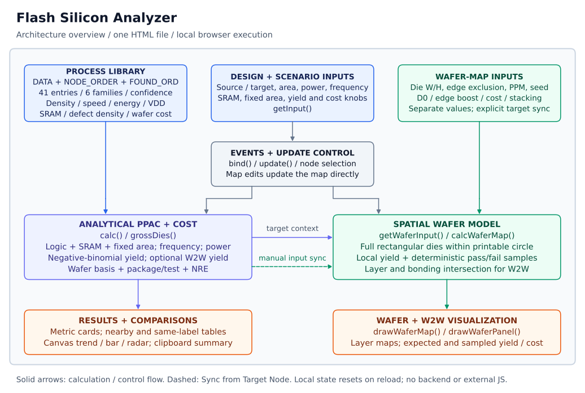

# Flash Silicon Analyzer

**Flash Silicon Analyzer** is a browser-based estimator for CMOS **power, performance, area, yield, and cost**. Start with a reference design, choose a source and target process, and explore the effects of logic scaling, SRAM, fixed area, manufacturing assumptions, and wafer-to-wafer (W2W) stacking.

The application is a single, self-contained [HTML file](index.html). It runs locally without an installation, backend, build step, or external JavaScript library.

[Paper PDF](paper/main.pdf) · [LaTeX source](paper/main.tex) · [Paper reproduction guide](paper/README.md) · [Editable draw.io diagram](docs/architecture.drawio) · [Source ledger](docs/sources.md)

## Quick start

Open `index.html` in a modern browser, or serve the repository locally:

```bash
git clone https://github.com/ldcyes/silicon_analysis.git flash-silicon-analyzer
cd flash-silicon-analyzer
python3 -m http.server 8000 --bind 127.0.0.1
```

Then open [http://127.0.0.1:8000](http://127.0.0.1:8000). Python is only needed for this optional HTTP server. Stop it with `Ctrl+C`.

JavaScript must be enabled. **Copy Summary** uses the browser clipboard API, so permissions and browser context can affect it; localhost is useful if copying from a local file fails. Inputs are held in memory and reset when the page reloads.

## What you can explore

- Source-to-target logic area, SRAM area, fixed area, and estimated frequency.
- Logic and optional SRAM power at the source frequency and the estimated target frequency.
- Negative-binomial defect yield, line/parametric yield, gross dies per wafer, and cost per good die.
- Introductory wafer-price and manufacturing-cost baselines, package/test, and NRE amortization.
- Trends, nearby-node tables, same-label foundry comparisons, and normalized bar/radar charts.
- Full rectangular-die wafer maps with edge exclusion, radial defect boost, extra PPM failures, and a repeatable random seed.
- Two- or three-layer W2W scenarios for the stack-enabled Huawei τ roadmap records, including per-interface bonding yield.

## Example: TSMC 12 nm → 6 nm

The initial main controls use TSMC N12FFC as the source and TSMC N6 as the target:

| Input | Default |
| --- | ---: |
| Logic area | 400 mm² |
| Logic power | 10 W |
| Frequency | 1 GHz |
| SRAM capacity / SRAM power / fixed area | 0 / 0 / 0 |
| Wafer diameter | 300 mm |
| Line yield / clustering α | 95% / 3 |
| Package and test | $2 per good die |
| Cost basis | Introductory wafer price |
| Area, frequency, power, defect, and cost multipliers | 1 |
| NRE / production volume | $0 / 1,000,000 |

The implemented model produces:

| Target metric | Result |
| --- | ---: |
| Logic and total area | 135.59 mm² |
| Estimated frequency | 1.20 GHz |
| Same-frequency power | 5.204 W |
| Power at estimated target frequency | 6.178 W |
| Yield including line yield | 79.03% |
| Analytical gross dies per wafer | 464.08 |
| Cost per good die including package/test | $36.07 |

The UI may round these values more coarsely. Changing only the cost basis to **manufacturing wafer cost** gives **$12.97** per good die. These are outputs of the embedded assumptions, not measurements or foundry quotes. Exact inputs and outputs are recorded in [experiments.json](paper/results/experiments.json).

To use your own design:

1. Select its current foundry/node and enter logic area, logic power, and frequency. Enter SRAM separately to avoid counting it twice; fixed IO/analog/pad area is added without scaling.
2. Select the target and adjust the area overhead, frequency realization, and power guardband.
3. Set the yield, wafer-cost basis, package/test, NRE, and volume assumptions. Inspect the selected process note and confidence label.
4. Review target results, nearby nodes, and foundry comparisons. A shared numeric node label does not imply equivalent physical technology.
5. For a matching wafer scenario, press **Sync from Target Node**, then adjust die aspect ratio, edge exclusion, PPM, and seed.

## Wafer-map behavior

**The wafer-map controls are independent of the main target controls.** On first load they describe 20 × 20 mm dies, D0 = 0.28 defects/cm², and a $4,024 wafer, rather than the selected N6 target. Main-input edits refresh the map without automatically copying these controls.

**Sync from Target Node** copies a square die derived from total target area, wafer diameter, D0, α, line yield, wafer cost, bonding yield, and layer count. It rounds dimensions to two decimal places and wafer cost to whole dollars. Edge exclusion, edge-defect boost, PPM, seed, and the stack-mode checkbox retain their values.

After synchronizing the default N6 case, the map has 448 full dies, 76.78% expected yield, and 352 passing dies at seed 2026. The analytical card uses a fractional gross-die approximation without the map's explicit edge exclusion, radial boost, or PPM penalty, so the views need not match. **Expected** yield uses probabilities; **Sim** yield uses one deterministic sampled realization.

For Huawei τ roadmap records, map stacking also requires **Use W2W stack** to be enabled. Changing layers affects modeled yield and wafer cost, while area/power/frequency factors stay those of the selected record.

## Supported process library

The evaluated revision contains **41 entries** across six families:

| Family | Selectable numeric node labels |
| --- | --- |
| TSMC | 28, 16, 12, 10, 7, 6, 5, 4, 3, 2 |
| Samsung | 28, 14, 12, 10, 7, 6, 5, 4, 3 |
| Intel | 14, 12, 10, 7, 4, 3, 2 |
| SMIC | 28, 14, 7 |
| GlobalFoundries / GF | 28, 22, 14, 12 |
| Huawei τ | 14, 10, 7, 6, 5, 4, 3, 2 |

These are the repository's comparison labels and modeled families. Intel entries include interpolated or grouped classes; GF 22FDX is a distinct FD-SOI entry. Huawei τ includes a conventional 14 nm reference and seven roadmap entries. This list is not a current commercial availability statement.

The library has 20 **High**, 14 **Medium**, and 7 **Roadmap** records. These qualitative labels do not certify every parameter or provide statistical error bounds. The selector excludes `low` and `alias` confidence codes, while some selectable records still use interpolation or class mapping.

## Architecture



Open [architecture.drawio](docs/architecture.drawio) in draw.io Desktop or [diagrams.net](https://app.diagrams.net/) using **File → Open From → Device**. Boxes, text, and connectors are editable. The layout uses explicit connector routes and labels placed clear of the lines. The SVG above and the [paper's vector PDF](paper/figures/architecture.pdf) are generated from the same diagram.

| Component in `index.html` | Responsibility |
| --- | --- |
| `DATA`, `NODE_ORDER`, `FOUND_ORD` | Process factors, ordering, and confidence notes |
| `availableNodes()`, `populateNodeSelect()` | Supported-node selection |
| `getInput()`, `calc()`, `grossDies()` | Main inputs and analytical PPAC/yield/cost |
| `getWaferInput()`, `calcWaferMap()`, `seededRand()` | Geometry, expected yield, and seeded pass/fail outcomes |
| `syncWaferFromTarget()` | Explicit transfer from target results into map controls |
| `updateCards()`, `updateNearby()`, `updateCompare()` | Metric and comparison presentation |
| `drawTrend()`, `drawBar()`, `drawRadar()`, `drawWaferMap()` | Native Canvas graphics |
| `bind()`, `update()`, `currentSummary()` | Events, refresh, and clipboard text |

## Model assumptions

The [paper](paper/main.pdf) provides the full equations. The central relationships are:

```text
target logic area = source logic area × source density / target density × area overhead
target SRAM area  = SRAM capacity / target SRAM density
target total area = target logic area + target SRAM area + fixed area
target frequency  = source frequency × target speed / source speed × realization
die yield         = (1 + D0 × area_cm² / alpha)^(-alpha)
stack yield       = (die yield × line yield)^layers × bond yield^(layers - 1)
cost / good die   = wafer cost × layers / (gross dies × final yield)
                    + package/test + NRE / production volume
```

Logic power is split into 92% dynamic and 8% leakage. Dynamic power uses relative energy and frequency factors; leakage uses an area/voltage heuristic. The power guardband affects logic dynamic power, not SRAM or leakage. SRAM dynamic power uses an inverse-density and squared-voltage heuristic. Fixed-area blocks have no separate power contribution. “Converged frequency” is a scaled estimate, not a timing-closure result.

Use this tool for early scenario exploration. The repository contains no PDK, transistor simulation, synthesis, placement/routing, timing signoff, thermal model, or measured accuracy benchmark. It does not enforce reticle limits, and small map dies can make synchronous updates expensive. The uploaded IBS-style tables and Huawei slides mentioned in the page are **not included in the repository**; their numerical values remain unverified defaults. See the [source and limitations ledger](docs/sources.md).

## Paper and reproducibility

The [arXiv-style manuscript](paper/main.tex) includes related work, architecture, implemented equations, node sweeps, sensitivity experiments, W2W scenarios, and limitations. It is a draft and has not been submitted to arXiv.

To rerun its numerical experiments, install Node.js (tested with v22.22.1), then run from the repository root:

```bash
node paper/scripts/evaluate.mjs
```

This executes the actual embedded JavaScript, records the HTML's SHA-256, checks 41 identity cases and all 1,681 source/target combinations, and writes `paper/results/experiments.json`. It also checks fixed-seed reproducibility and selected edge cases. These checks establish arithmetic consistency, not silicon accuracy.

Figure generation and LaTeX compilation are optional; see [paper/README.md](paper/README.md) for dependencies, commands, and source packaging.

```text
index.html                    Self-contained application
LICENSE                       Apache-2.0 license
docs/architecture.drawio       Editable architecture diagram
docs/architecture.svg          Diagram preview
docs/sources.md                Source provenance and claim boundaries
paper/main.tex                 Manuscript source and inline bibliography
paper/main.pdf                 Compiled manuscript
paper/figures/                 Vector paper figures
paper/results/                Reproducible numerical outputs
paper/tables/                 Generated LaTeX tables
paper/scripts/                Evaluation, rendering, and packaging helpers
```

## Contributing and license

The runtime has no package manager or compilation step. Edit `index.html` and reload the browser. For model/library changes, document units, the exact source and comparison conditions, confidence, and whether each parameter is measured, inferred, or assumed. Rerun the paper experiments and update affected claims and figures.

Licensed under [Apache License 2.0](LICENSE). The project and paper author is **Liang Dacheng**. The application credits GPT5.5 for AI assistance, and the manuscript also discloses AI assistance.
